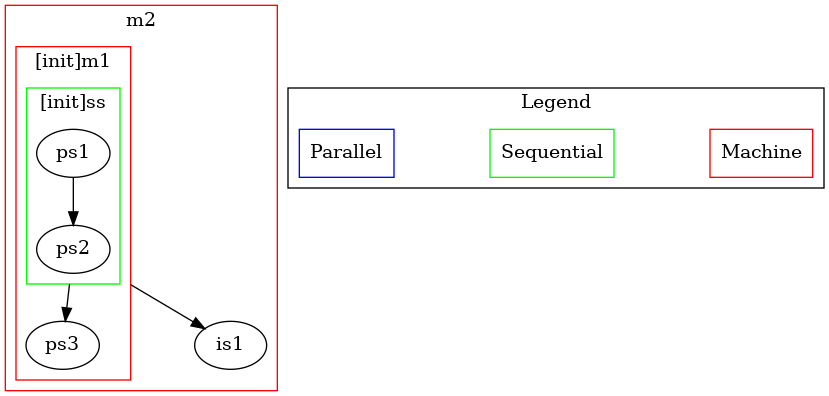

# Behavior_Machine
Copyright - Transportation, Bots, and Disability Lab, Carnegie Mellon University  
Released under MIT License  

This is an implementation of a hierarchical state machine but with additional behavior-tree like features (Sequential, Parallal, etc). Unlike behavior trees, the execution of each state is independent of the tick (A repeative signal generated from the root). The transition of the state are determined by the machine's tick but can be set at different levels

## Illustrative Example:
```
from behavior_machine.core import State, Machine
from behavior_machine.library import PrintState, SequentialState, IdleState


ps1 = PrintState("ps1", "Hello World 1")
ps2 = PrintState("ps2", "Hello World 2")
is1 = IdleState("is1")
ps3 = PrintState("ps3", "Hello World 3")

ss = SequentialState("ss", children=[ps1, ps2])
ss.add_transition_on_success(ps3)

m1 = Machine("m1", ss, rate=10)
m1.add_transition(lambda state, board: state._curr_state._name == "ps3", is1)
m2 = Machine("m2", m1, end_state_ids=['is1'], rate=10)
m2.run()
```



## Documentation
You can view more detailed documentation by following this [link](https://behavior-machine.readthedocs.io/en/latest/index.html)


## TODO Lists:
1. Implement flows for `ParallelState`. The idea would be the same flow value is duplicated (deep?) for each state
2. Rethink flows for `SelectorState`.
3. A better logging system.